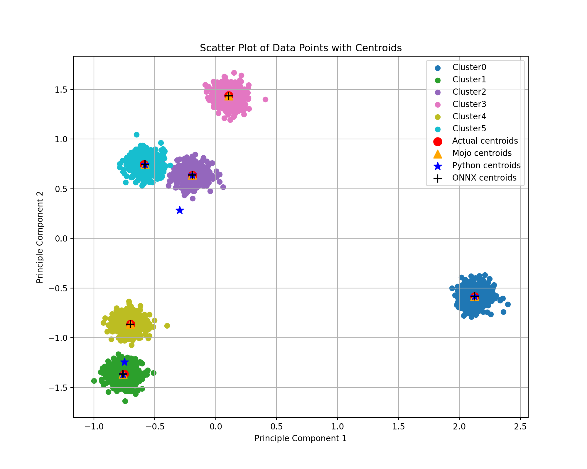

# 使用ONNX实现传统算法——以Kmeans聚类为例并和python/mojo实现对比

ONNX模型主要用于深度模型通用的表示和推理。但是，也可以将传统算法函数使用ONNX模型来表示。这样做的优点包括：

1.  生成统一的包含传统算法和深度模型的算法函数，并以ONNX模型的形式保存
2.  方便算法部署实现，ONNX模型是与语言和运行平台无关的描述，无需将算法逻辑与某个语言实现和环境固定在一起，它也提供了各个语言的接口方便调用
3.  可以利用每个平台和环境提供的Execution Provider来获得高效推理结果，如Intel、AMD和Nvidia各自的推理库OpenVINO、TensorRT和ROCm，以及移动平台的高通QNN、苹果CoreML和安卓NNAPI等。

最近modular的一篇[博客](https://www.modular.com/blog/fast-k-means-clustering-in-mojo-guide-to-porting-python-to-mojo-for-accelerated-k-means-clustering)中将Python、scikit-learn和mojo实现的Kmeans聚类算法对比。这里也利用了这个例子中的配置，并与其他方案做对比。注意这里的python/numpy实现是在博客原版的基础上做了一点pythonic优化的，比原版速度更快。

简单地讲一下Kmeans算法的流程：

1.  Kmeans++初始化，核心思想是产生尽量分散的初始中心。具体算法是：随机选择一个数据点作为第一个初始中心后，迭代产生剩下的初始中心。每次迭代时计算所有数据点到最近中心的距离。以归一后的最近距离为概率，随机采样一个数据点作为初始中心。
2.  Kmeans迭代，思想是将数据点分给其最近的中心，然后同一类的点的平均值作为新中心。循环迭代以上步骤直到惯性inertia（数据点到其中心的距离和）变化值小于阈值。

具体实现上，直接使用onnx库来手动编写ONNX算法模型是不太现实的。而[onnxsxript](https://github.com/microsoft/onnxscript)和[spox](https://github.com/Quantco/spox)两个库可以方便地将一定格式的python函数转换为相应的onnx graph和model。经过对比，onnxscript对于python的运算重载更多，也能自动转换逻辑控制为相应的op.If和op.Loop等，所以选用onnxscript来实现。

依赖安装

```
pip install onnx onnxruntime onnxscript onnxsim
```

如果需要运行`run_kmeans.mojo`来对比四种实现，则需要[安装mojo语言](https://docs.modular.com/mojo/manual/get-started/)。否则使用python运行`onnx_kmeans/create_model.py`即可。

下面是python/numpy和onnx在初始化这一步的代码对比。

onnx
```python
    num_sample = op.Shape(data)[0]
    random_index = op.Cast((op.RandomUniform(dtype = onnx.TensorProto.DOUBLE, shape = [1])*op.Cast(num_sample, to = onnx.TensorProto.DOUBLE)), to = onnx.TensorProto.INT64)[0]
    random_sample = data[random_index]
    centroid_list = op.SequenceConstruct(random_sample)
    for i in range(n_clusters-1):
        centroid_array = op.Unsqueeze(op.ConcatFromSequence(centroid_list, axis = 0, new_axis=1), axes = [1]) # (num_centroid, 1,  num_feature)
        centroids_distances = op.ReduceSum((centroid_array - data)**2, axes = [2], keepdims = 0) # (num_centroid, num_sample)
        min_distances = op.ReduceMin(centroids_distances, axes=[0], keepdims=0)
        probs = min_distances/op.ReduceSum(min_distances)
        cumulative_probs = op.CumSum(probs, axis = 0)
        rand_prob = op.RandomUniform(dtype = onnx.TensorProto.DOUBLE, shape = [1])
        selected_index = op.ArgMin(op.Abs(cumulative_probs - rand_prob), keepdims = 0)
        centroid_list = op.SequenceInsert(centroid_list, data[selected_index])
```
python
```python
self.centroids.append(data[np.random.randint(data.shape[0])])  

        for idx_c in range(1, self.k):
            # Update distances for all points relative to the new set of centroids
            # self.distance_norm(data)
            
            self.centroids_distances = np.sum((np.asarray(self.centroids) - data[:, None])**2, axis = -1) # (num_sample, num_centroids)
            
            # Find the minimum distance to any centroid for each point
            min_distances=self.centroids_distances.min(axis=1)

            # Probability of selecting next centroid is proportional to squared distance
            probs=min_distances / min_distances.sum()
            # Cumulative probabilities for selection
            cumulative_probs=probs.cumsum() 

            # Select the next centroid based on cumulative probabilities
            rand_prob=np.random.rand()
            for i in range(len(cumulative_probs)):
                if rand_prob < cumulative_probs[i]:
                    self.centroids.append(data[i,:])
                    break
```

可以看出，相比于python使用numpy的函数，onnxscript需要使用[onnx operator算子库](https://onnx.ai/onnx/operators/index.html)来实现大多数的操作，而小部分操作如四则运算、简单索引则可以直接使用并且自动转换。

运行`run_kmeans.mojo`的输出（Intel i5-11500）

```
======== Mojo Kmeans ========
Iteration: 0, inertia: 62731254.221856028
Iteration: 1, inertia: 27487287.858090311
Iteration: 2, inertia: 23963468.695913218
Iteration: 3, inertia: 23963468.695913218
Converged at iteration: 3 Inertia change less than tol: 0.0001
 Final inertia: 23963468.695913218
Mojo Kmeans complete (ms): 15.358354

======== Python Kmeans ========
Iteration: 0, inertia: 62767612.00986422
Iteration: 1, inertia: 32942048.482606836
Iteration: 2, inertia: 32139243.444038555
Iteration: 3, inertia: 32139243.444038555
Converged at iteration: 3 Inertia change less than tol: 0.0001
 Final inertia: 32139243.444038555
Python Kmeans complete (ms): 292.76626399999998

======== SKLearn Kmeans ========
Initialization complete
Iteration 0, inertia 47519310.32400749.
Iteration 1, inertia 23963468.695913214.
Converged at iteration 1: strict convergence.
Python Kmeans complete (ms): 44.343997000000002

======== ONNX Kmeans ========
ONNX Kmeans complete (ms): 178.82597799999999

Config:
n_clusters = 6
n_samples =  3000
n_features =  500

Speedup Mojo vs. Python: 19.06234639467224
Speedup Mojo vs. SKLearn: 2.8872883773873164
Speedup Mojo vs. ONNX: 11.643564017341962

Comparing final inertia:
Mojo kmeans final inertia: 23963468.695913218
Python kmeans final inertia: 32139243.444038555
SKlearn kmeans final inertia: 23963468.695913218
ONNX kmeans final inertia: 23963468.69591321
```

pca降维可视化结果。每种实现的结果差异应该来自随机初始化。



从运行速度看，onnx实现慢于mojo和scikit-learn，但快于python/numpy。原因可能是目前onnx规范和onnxruntime对于这种动态形状的支持仍然有限，并不能实现形状的符号计算，所以内存分配优化有限。

# Using ONNX to implement traditional algorithms - taking Kmeans clustering as an example and comparing it with python/mojo

The ONNX model is mainly used for general representation and reasoning of deep models. However, traditional algorithms can also be represented using ONNX models. The advantages of doing this include:

1.  Generate a unified algorithm function containing traditional algorithms and deep models, and save it in the form of ONNX model
2.  Convenient for algorithm deployment and implementation, the ONNX model is a description that is independent of language and operating platform. There is no need to fix the algorithm logic with a certain language implementation and environment. It also provides interfaces in each language for easy calling.
3.  You can use the Execution Provider provided by each platform and environment to obtain efficient inference results, such as Intel, AMD and Nvidia's respective inference libraries OpenVINO, TensorRT and ROCm, as well as Qualcomm QNN, Apple CoreML and Android NNAPI for mobile platforms.

A recent modular [blog](https://www.modular.com/blog/fast-k-means-clustering-in-mojo-guide-to-porting-python-to-mojo-for-accelerated-k-means-clustering) compared the Kmeans clustering algorithms implemented in Python, scikit-learn and mojo. The configuration in this example is also used here and compared with other solutions. Note that the python/numpy implementation here is a little pythonic optimized based on the original version of the blog, and is faster than the original version.

Briefly talk about the process of Kmeans algorithm:

1.  Kmeans++ initialization, the core idea is to generate initial centers that are as dispersed as possible. The specific algorithm is: after randomly selecting a data point as the first initial center, it iteratively generates the remaining initial centers. The distances of all data points to the nearest center are calculated at each iteration. Taking the normalized nearest distance as the probability, randomly sample a data point as the initial center.
2.  Kmeans iteration, the idea is to assign the data points to their nearest centers, and then the average of the points of the same class is used as the new center. The above steps are iterated in a loop until the change value of inertia (sum of the distance from the data point to its center) is less than the threshold.

In terms of specific implementation, it is unrealistic to directly use the onnx library to manually write the ONNX algorithm model. The two libraries [onnxsxript](https://github.com/microsoft/onnxscript) and [spox](https://github.com/Quantco/spox) can easily convert python functions in a certain format into corresponding onnx graphs and models. After comparison, onnxscript has more overloading of python operations, and can also automatically convert logic control into corresponding op.If and op.Loop, etc., so onnxscript is chosen for implementation.

Depends on installation

```
pip install onnx onnxruntime onnxscript onnxsim
```

If you need to run `run_kmeans.mojo` to compare the four implementations, you need to [install the mojo language](https://docs.modular.com/mojo/manual/get-started/). Otherwise, just use python to run `onnx_kmeans/create_model.py`.

The following is a code comparison between python/numpy and onnx in the initialization step.

onnx
```python
    num_sample = op.Shape(data)[0]
    random_index = op.Cast((op.RandomUniform(dtype = onnx.TensorProto.DOUBLE, shape = [1])*op.Cast(num_sample, to = onnx.TensorProto.DOUBLE)), to = onnx.TensorProto.INT64)[0]
    random_sample = data[random_index]
    centroid_list = op.SequenceConstruct(random_sample)
    for i in range(n_clusters-1):
        centroid_array = op.Unsqueeze(op.ConcatFromSequence(centroid_list, axis = 0, new_axis=1), axes = [1]) # (num_centroid, 1,  num_feature)
        centroids_distances = op.ReduceSum((centroid_array - data)**2, axes = [2], keepdims = 0) # (num_centroid, num_sample)
        min_distances = op.ReduceMin(centroids_distances, axes=[0], keepdims=0)
        probs = min_distances/op.ReduceSum(min_distances)
        cumulative_probs = op.CumSum(probs, axis = 0)
        rand_prob = op.RandomUniform(dtype = onnx.TensorProto.DOUBLE, shape = [1])
        selected_index = op.ArgMin(op.Abs(cumulative_probs - rand_prob), keepdims = 0)
        centroid_list = op.SequenceInsert(centroid_list, data[selected_index])
```
python
```python
self.centroids.append(data[np.random.randint(data.shape[0])])  

        for idx_c in range(1, self.k):
            # Update distances for all points relative to the new set of centroids
            # self.distance_norm(data)
            
            self.centroids_distances = np.sum((np.asarray(self.centroids) - data[:, None])**2, axis = -1) # (num_sample, num_centroids)
            
            # Find the minimum distance to any centroid for each point
            min_distances=self.centroids_distances.min(axis=1)

            # Probability of selecting next centroid is proportional to squared distance
            probs=min_distances / min_distances.sum()
            # Cumulative probabilities for selection
            cumulative_probs=probs.cumsum() 

            # Select the next centroid based on cumulative probabilities
            rand_prob=np.random.rand()
            for i in range(len(cumulative_probs)):
                if rand_prob < cumulative_probs[i]:
                    self.centroids.append(data[i,:])
                    break
```

It can be seen that compared to Python's use of numpy functions, onnxscript needs to use the [onnx operator library](https://onnx.ai/onnx/operators/index.html) to implement most operations, while a small number of operations such as four arithmetic operations and simple indexes can be used directly and automatically converted.

Output from `running run_kmeans.mojo` (Intel i5-11500)

```
======== Mojo Kmeans ========
Iteration: 0, inertia: 62731254.221856028
Iteration: 1, inertia: 27487287.858090311
Iteration: 2, inertia: 23963468.695913218
Iteration: 3, inertia: 23963468.695913218
Converged at iteration: 3 Inertia change less than tol: 0.0001
 Final inertia: 23963468.695913218
Mojo Kmeans complete (ms): 15.358354

======== Python Kmeans ========
Iteration: 0, inertia: 62767612.00986422
Iteration: 1, inertia: 32942048.482606836
Iteration: 2, inertia: 32139243.444038555
Iteration: 3, inertia: 32139243.444038555
Converged at iteration: 3 Inertia change less than tol: 0.0001
 Final inertia: 32139243.444038555
Python Kmeans complete (ms): 292.76626399999998

======== SKLearn Kmeans ========
Initialization complete
Iteration 0, inertia 47519310.32400749.
Iteration 1, inertia 23963468.695913214.
Converged at iteration 1: strict convergence.
Python Kmeans complete (ms): 44.343997000000002

======== ONNX Kmeans ========
ONNX Kmeans complete (ms): 178.82597799999999

Config:
n_clusters = 6
n_samples =  3000
n_features =  500

Speedup Mojo vs. Python: 19.06234639467224
Speedup Mojo vs. SKLearn: 2.8872883773873164
Speedup Mojo vs. ONNX: 11.643564017341962

Comparing final inertia:
Mojo kmeans final inertia: 23963468.695913218
Python kmeans final inertia: 32139243.444038555
SKlearn kmeans final inertia: 23963468.695913218
ONNX kmeans final inertia: 23963468.69591321
```

Visualization of PCA dimensionality reduction. The difference in the results of each implementation should come from random initialization.


In terms of running speed, onnx implementation is slower than mojo and scikit-learn, but faster than python/numpy. The reason may be that the current onnx specification and onnxruntime still have limited support for such dynamic shapes, and cannot implement symbolic calculations of shapes, so memory allocation optimization is limited.
